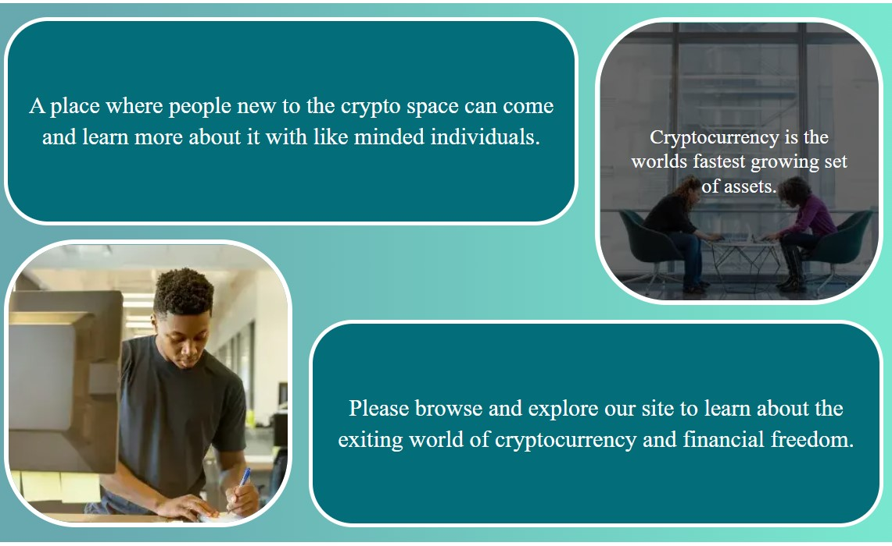

# **Crypto Hub**

Welcome to **[crypto hub!](https://mattmurnaghan.github.io/Project-one-crypto-hub/index.html)** 

A place where people who are not very familiar with cryptocurrency can learn more about the terminology and some of the top coins that dominate the market.

## Site sections:
---
This site consists of 6 sections/pages:
1. Home
2. Guide
3. Currencies
4. Exchanges
5. Glossary
6. Contact Us
## Business goals
---
The business goal for this site is to:
1. The site provides a beginner's guide to crypto for those who have not got much if anything about cryptocurrency.  
2. Generate interest in cryptocurrency and a desire to further get involved through trading and exploring other services available in the crypto space

## User Goals
---
The site is primarily focused on first-time users as it offers updated content by way of a newsletter and discord server. However, there are some recurring user benefits outlined below:
### First-time visitors:
1. I want to easily find useful information regarding cryptocurrency, what it is and how it affects me.
2. I want to learn how I can buy cryptocurrencies and what I can do with them after I buy them.
3. I want to know how to research crypto projects, what is available to invest in and what services are available.
4. I want to easily sign up to a newsletter and/or discord server to learn more and stay up to date with new info in the crypto space.

### Recurring Visitors
1. I want to review the glossary of terms to better understand how to assess the performance of currencies in the market.
2. I want to review any updated content to stay up to date with market trends.
3. I want to easily find affiliate links to different social media platforms related to the presented material.

## **User Journey**

### Welcome page - A gentle introduction
---
* This page welcomes the user to the site and defines what a cryptocurrency is, how it affects the economy and what its purpose is in the global economy. 
* The goal of this page is to introduce crypto unambiguously.
* The imagery and text should highlight the collaborative aspect of cryptocurrency and the individuals and groups (countries and companies) that are starting to embrace cryptocurrency as a new legal tender and means of trade.

### Guides - How does it work?
---
* This page defines what a blockchain is, the different ways to buy crypto, how to store it and a few video links to some helpful explanatory videos.
* A visitor should have a basic grasp of what cryptocurrency is now and will be looking to learn about how they can get involved and what to do once they have purchased their crypto.

### Currencies - Popular currency review 
---
* This page goes through some of the most popular currencies and the fundamental differences between them. 
* The first section defines what a whitepaper is to the user and why it is important when it comes to researching different cryptocurrencies to invest in.
* Each section gives an overview of the currency, an explanation of its technology, its place in the market as well as a link to its whitepaper.
* There is a series of video links covering exactly what a whitepaper is as well as each mentioned cryptocurrency at the bottom of the page.
* At this point, a visitor should have a fair grasp on what a blockchain is, how it is fundamental to cryptocurrency, what sort of currencies they can invest in and how to research any new crypto projects that they might be interested in.

### Exchanges - The best places to trade
---
* This page lists some of the most popular exchanges where you can invest and some key details particular to each exchange. 
* It features a pros and cons list for the chosen exchanges and a brief overview of each.
* There are a series of video links covering each exchange and how an exchange works at the bottom of the page.
* Now, a visitor should be informed of how a crypto exchange works and will have directions to four different popular crypto exchange sites where they can begin trading.
 ### Glossary - Terminology explained
 ---
* This page goes through some of the more complicated terms when it comes to investing in crypto. 
* Its purpose is to make it easier for novice investors to make informed decisions about their investments.
* When a visitor arrives at this point, they have learned most of what the site has to offer and will be directed to the contacts page.
* Return users will visit this section most frequently when brushing up on terminology that they do not understand.

### Contact us - Meet like-minded individuals
This page allows site visitors to sign up for a mailing list and connect with other like-minded individuals. It also gives a link to a discord channel where people who sign up can talk about investments and ask questions with their peers.

## **UX**
### Strategy
---
Crypto Hub aims to educate site visitors about cryptocurrency. The site covers the basic technology that allows cryptocurrencies to exist, the different currencies available to invest in, how to purchase and store their crypto and how to research blockchain projects that they are interested in.
To keep in line with core UX principles, I considered the factors listed below:  
### Target Audience
---
The site is aimed at users of all ages, as cryptocurrency is still a mysterious topic for many. However, there is a slight leaning towards users aged 18-30, as these users are typically further willing to invest in newer opportunities, rather than more established stock holdings and investment opportunities.
### Scope
---
In order to achieve the desired user & business goals, the following features will be included in this release:
* Header and responsive menu bar, for easy site navigation on both mobile and desktop views
* Information sections with a similar core layout
* Information on some of the top cryptocurrencies and their backgrounds
* Information on the most popular exchanges, pros and cons lists of their platforms and links to their respective sites
* A glossary section with dropdown menus so as not to overwhelm the user with information
* Video links section explaining the topics covered on each page
* A signup form to subscribe to a mailing list
* A link to a discord server where visitors can connect with like-minded individuals and other site users, looking to discuss crypto-related topics and share their journies

### Structure
---
I chose a multiple-page structure for the site as I felt it was easier to deliver the information in this way. 
The information architecture was designed as such:

Home Page > Guides > Currencies > Exchanges > Glossary > Contact Us

Structuring the information in this way allows site users to learn about cryptocurrency in an intuitive manner and in a way that should feel natural to them:
1. First, a user is introduced to the site and shown some of the benefits of cryptocurrency and that it has a use case in real-world applications.
2. Then a user is introduced to the technology behind cryptocurrency, how they can purchase it and what to do with it once they have some.
3. After this, a user learns which currencies are popular and how to research new projects that interest them.
4. The next section informs a user of what a crypto exchange is as well as the different exchanges that are currently protected under financial regulations and provide links to each one.
5. At this stage, a user is given a summary page with more complicated terminology to help clear up any confusion on certain financial and technological terms that the user may be unclear on.
6. Finally, a user is prompted to sign up to a mailing list where they can be presented with regular information about the crypto space. They can also join a discord server where they can chat with like-minded peers and other site visitors to learn more about crypto and share their investment journeys.

### Skeleton
---
[Wireframes](docs/wireframes/crypto-hub-wireframes.pdf)

Linked above are the wireframes for the site. They show examples of both a desktop and mobile view of the site.
The design has changed slightly in terms of color scheme and layout but has remained mostly the same.

* I added some hover effects to the images on the home page, revealing some interesting facts about crypto when a user mouses over them.

* To implement this same feature on mobile, I made the text boxes permanent and slightly opaque, as there would be no cursor to trigger the effect.

* I added some hover effects to the navbar to give a better sense of feedback to the user. 

* I added a burger menu navbar for mobile users, on the right-hand side, as I felt this was the best way for a user to navigate the site one-handed.

* I also added some animated arrows directing users to the video sections, as well as on the contact us page.

* Originally, the discord link had no text, was circular and contained the discord icon only. However, real user testing showed that not many people realized that this was a clickable link. 

* In response to this, I added the animated arrow as well as a press me element, along with some text directing the user to join the website's discord server. I felt that it gave better direction to the users to click the link and increase engagement.

### Surface
---
I chose a color palette around blues and greens as they have a strong connection to the business world and finance in general (IBM, Facebook, Coinbase etc.).
These colors evoke a psychological response, triggering feelings of calm, security and tranquility, all the perfect feelings to evoke in a user who is new to the crypto-space and quite possibly already skeptical of the subject.

I used a gradient background to distinguish individual sections and create some depth on the page. I used a dark blue/green color with white text for reading sections to provide appropriate contrast. 

I used two different fonts for the site, 'Roboto Slab' for any heading sections and 'Lato' for the body text. See the example below:

## **Features**
---
This website is fully responsive and was designed for desktop first and adapted to fit a mobile view. Sections are broken up into different colored backgrounds following the same information presentation style, to create a sense of familiarity for the user. There are three different layouts on the site, A, B, C and D.
* Layout A is used for the homepage.
* Layout B is used for the guides, currencies and exchanges pages.
* Layout C is used for the glossary page.
* Layout D is used for the contact us page.

## Layout A
### Hero Image 
---
The hero image for the site has a slight zoom effect when loading into the homepage. The image I chose shows someone's hand holding a physical bitcoin, which serves as a metaphor for the user being able to get a grasp of what cryptocurrency is about as well as taking their financial situation into their own hands.

When serving this image to mobile users, I used a .webp image format as the original .jpg was causing too much delay to the page load.  

### Navbar
---
The navbar is a sticky element, placed at the top of the page and stays present when scrolling throughout site navigation. It provides the user with an easy way to navigate back and forth between site pages. 
* The page that the user is currently viewing is marked with an active style and is underlined to keep the user informed of their current position on the site. 
* There is a hover effect added to the rest of the elements with the same underline as the active tag to provide feedback to the user.

||
|:--:|
| <strong>Navbar - Desktop View</strong>  |

I replaced the navbar with a burger menu opening from the side of the screen for mobile users as I felt this was a more appropriate method of site navigation for that type of device. 

||
|:--:|
| <strong>Navbar - Mobile View</strong>  |

The element uses a checkbox with opacity 0 behind a burger menu icon to toggle a media query, hiding the element at the side of the page.

||
|:--:|
| <strong>Navbar - Mobile view expanded</strong>  |

### Section row
---  
The information section of the home screen presents the user with some different welcome messages to the site. Each section is headed by an H2 element on a colored background, offset against the white background of the site. 
||
|:--:|
| <strong>Section Row - welcome messages</strong>  |

Alongside the welcome messages are some images. Each image has a hover effect that presents some extra information about crypto to the user when placing the cursor on the image. This effect was implemented by setting a p tag to occupy the same space as the image using a grid layout. The zoom and reveal were implemented using a hover transition effect. 

||
|:--:|
| <strong>Section Row - Image hover effect</strong>  |

For mobile, I removed the hover effect for the overlay text on the images and added them as permanent boxes with translucent color backgrounds, due to the lack of a cursor to trigger the effect.

I also shifted the rows and images to sit on top of each other instead of side by side, as this was a better fit for longer mobile screens, vs wider desktop ones.

||
|:--:|
| <strong>Section Row - Mobile view</strong>  |

### Next Page 
---
A next page link inside of a div element was implemented at the bottom of each page, barring the contact page, to give the user a quick and easy way to progress through the site. There is a hover effect placed on the button to scale up its size when a user places their cursor on it.

||
|:--:|
| <strong>Next page element</strong>  |

### Footer 
---
There is also a footer section at the bottom of each page, with four social media links, created using icons from fontawesome inside a tags.

||
|:--:|
| <strong>Footer element at the bottom of each page</strong>  |

## Layout B
### Guides - Section row
---
The information presentation style for layout B is shared for the mostpart by the guides, currencies and exchanges pages. It consists of a colored row background to break up sections, holding a dark-colored div element, centered on the page and offset with white text for appropriate contrast. 

Each subheader is underlined with an hr tag and uses the same Roboto Slab font shared with the rest of the heading elements throughout the site. 

||
|:--:|
| <strong>Layout B - Centered row element</strong>  |

At the bottom of each page for layout B, there is a video links section, using a responsive iframe to show video links on the different topics covered by each section of the page. there is an animated arrow that bobs up and down above this section to draw the attention of the user and encourage them to click and watch the videos.

||
|:--:|
| <strong>Layout B - Video links</strong>  |

There are some a tag elements below each video as well as a scrollbar with scroll snap properties to allow easy selection of each video. There is a hover effect applied to each selector, changing the color to an off-white background and raising the element when the cursor is placed on it.

## Layout C
### Glossary 
---

This section was created using the center div element style from layout B but has some new dropdown div elements created with the same hidden checkbox method used for the mobile burger menu. Each element is given an aria label to satisfy accessibility standards. when clicked, the element reveals a dropdown section giving a specific explanation for the investment terms listed at the top of the dropdown. 

||
|:--:|
| <strong>Layout C - Glossary dropdowns</strong>  |

## Layout D

### Form 
---
The final page has a different layout, holding a form element and a discord sign-up link, as well as a privacy statement using the same dropdown element as seen in the glossary section.

||
|:--:|
| <strong>Layout D - Contact us section</strong>  |

Each input in the form has an appropriate label and uses CSS to place the label above the input on its border.
There is also a checkbox option to allow the user to receive targeted advertisements about other crypto products and services.

All of this form data is sent with a POST action to the formdump link provided by the code institute and opens in a new tab when submitted. The signup button also changes color when the user hovers over it to provide further feedback.

||
|:--:|
| <strong>Layout D - Form element</strong>  |

### Discord Sign up
---
There is also a discord sign-up link with the same animated arrow element from earlier displayed above the video links. When a user hovers over the link, it will scale up and change color, encouraging the user to click on the element.

||
|:--:|
| <strong>Layout D - Discord sign up hover effect</strong>  |

## **Technology and Tools**

I employed several different design tools and different technologies to help create and test this website:

- [HTML](https://developer.mozilla.org/en-US/docs/Web/HTML)
    - Used as the basic building block for the project and to structure the content.
- [CSS](https://developer.mozilla.org/en-US/docs/Learn/Getting_started_with_the_web/CSS_basics)
    - Used to style all the web content across the project and created animated & interactive elements.
- [Google Fonts](https://fonts.google.com/)
    - Used to obtain the fonts linked in the header, the fonts used were Lato and Roboto Slab.
- [Font Awesome](https://fontawesome.com/)
    - Used to obtain the social media icons used in the footer discord sign-up link.
- [Google Developer Tools](https://developers.google.com/web/tools/chrome-devtools)
    - Used as a primary method of fixing spacing issues, finding bugs, and testing responsiveness across the project.
- [GitHub](https://github.com/)
    - Used for code and documentation storage and website deployment through github pages.
- [Git](https://git-scm.com/)
    - Used for version control through the Gitpod terminal.
- [Gitpod](https://www.gitpod.io/)
    - Used as the development environment.
- [Balsamiq](https://balsamiq.com/)
    - Used to create the wireframes for the project.
- [gauger.io](https://gauger.io/fonticon/)
    - Used to create the favicon for my website.
- [onlineimagetool](https://www.onlineimagetool.com/en/resize-png-jpg-webp-gif)
    - Allowed me to compress my images and change the image format to increase performance and page load.
- [W3C Markup Validation Service](https://validator.w3.org/) 
    - Used to validate all HTML code written and used in this webpage.
- [W3C CSS Validation Service](https://jigsaw.w3.org/css-validator/#validate_by_input)
    - Used to validate all CSS code written and used in this webpage.
- [Prettier.io](https://prettier.io/)
    - Used to format my code.
- [Canva color wheel](https://www.canva.com/colors/color-wheel/)
    - Used to create a color palette for the site.
- [Gradient.io](https://cssgradient.io/)
    - Used to create the gradient used across the site.
- [AmIResponsive](http://ami.responsivedesign.is/)
    - Used to generate responsive image used in README file.

## **Testing**

The typical first-time user on this site is someone with little to no experience in the crypto space. As such, the journey should take a user from a novice position to one who feels they understand the crypto-space enough to begin to invest and explore other associated products.

### User stories
---

1. **I want to easily find useful information regarding cryptocurrency, what it is and how it affects me.**

It is clear from the minute that you load up the page, that you are on a site dealing with cryptocurrency. 
* The bitcoin logo is present in the hero image with a bunch of charts in the background.  
* The title of the website is called the crypto hub.
* The first sentence that the user reads reassures them that this is a place for people that are new to the crypto space.
    * This ensures that users shouldn't feel threatened reading through the site material even with no prior experience in cryptocurrency.

||
|:--:|
| <strong>Welcome page</strong>  |

Further down the page, the user will see a section explaining what cryptocurrency is: 

| |
|:--:|
| <strong>Section explaining what crypto is</strong>  |

<i>How does it affect me?</i>

| |
|:--:|
| <strong>Section explaining how crypto affects our economy</strong>  |

2. **I want to learn how I can buy cryptocurrencies and what I can do with them after I buy them.**

On the guides page, the user has their questions addressed straight away with specific headers answering each of their questions in detail. 

<i>How can I buy it?</i>

| |
|:--:|
| <strong>Section explaining the different ways to buy crypto</strong>  |

<i>What can I do with it after I buy it?</i>

| |
|:--:|
| <strong>Section explaining the different ways to store crypto</strong>  |

Finally, to help recap everything that the page has talked about, there are specific videos at the bottom of each page presenting the user with a visual learning style as well, to help compound their learning and expose them to some other learning resources available online.

3. **I want to know how to research crypto projects, what is available to invest in and what services are available.**

On the currencies page, some of the different kinds of cryptocurrencies are listed, as well as how to research crypto projects and which projects are currently popular.
As before, each question is addressed with a separate section.

<i>Researching different crypto projects</i>

| |
|:--:|
| <strong>Section explaining the different ways to store crypto</strong>  |

Here, the user is told about what a whitepaper is and its importance in determining whether a crypto project is a good one to invest in or not.

<i>What is available to invest in?</i>

| |
|:--:|
| <strong>Section explaining what bitcoin is</strong>  |

Here the user is given an overview detailing what bitcoin is, its place in the market and its origins. They are also given a link to the wiki page on the creator of Bitcoin, as well as a link to bitcoin's whitepaper.

The same is done for smart contracts, Ethereum, and stablecoins, all important projects and crypto types in the crypto space.

<i>What services are available?</i>

| |
|:--:|
| <strong>Section explaining what a crypto exchange is</strong>  |

This section addresses what a crypto exchange is to the user before giving some recommendations of popular exchanges that are used at the moment.

| |
|:--:|
| <strong>Section listing the pros and cons of Binance and a link to the exchange</strong>  |

Above is the format used to review the different exchanges that are financially protected and available to start using right now. At the bottom of the section, there is also a link to the Binance exchange. 

The same is also done for the Coinbase, Kraken and Gemini exchanges.

4. **I want to easily sign up to a newsletter and/or discord server to learn more and stay up to date with new info in the crypto space.**

The contact page addresses this user goal directly, prompting the user to sign up for a mailing list dedicated to crypto information, as well as giving them the option to hear more about crypto-related products and services.

| |
|:--:|
| <strong>Section prompting the user to sign up for a crypto mailing list</strong>  |

Users are also prompted to sign up to the discord server to discuss crypto with other users and see any updated content.

| |
|:--:|
| <strong>Section prompting the user to join a discord server with other site visitors</strong>  |

### Recurring Visitors

1. **I want to review the glossary of terms to better understand how to assess the performance of currencies in the market.**

This question is addressed with the glossary page and serves as a resource for users to revisit if they are looking to brush up on their crypto market terminology.

| |
|:--:|
| <strong>Section showing crypto market terms to be reviewed</strong>  |

2. **I want to review any updated content to stay up to date with market trends.**

This section is best addressed by the discord server signup option and the mailing list, as these two points of contact should be directing new content towards recurring visitors and directing them back to the site in case any sections are updated. 

3. **I want to easily find affiliate links to different social media platforms related to the presented material.**

Anyone revisiting the site seeking any affiliate links for social media platforms can easily find them by using the footer section at the bottom of each page.

| |
|:--:|
| <strong>Section showing links to different social media pages ran by the same people behind cryptohub</strong>  |

## **Lighthouse Scores**

## **Bug Fixes and Issues**
There were multiple bugs encountered during the development of this project. These were listed along with the methods employed as solutions to each.

### Working with percentages
---
* An issue I found when working with percentages was scaling. 
* When adjusting the zoom/resolution for the site, I found that some of the divs were scaling improperly. They were shrinking to a point where they could not hold their content.
* The title div was changing size and proportion to where it was not consistent with the design theme for the rest of the home page. (See fig. 1 & 2 below)
### Issue

||
|:--:|
| <strong>Fig.1 Improper scaling when zooming out</strong>  |

||
|:--:|
| <strong>Fig.2 Improper scaling when zooming in</strong>  |

### Fix 

* To fix the issue, I started using fixed sizing in pixels for select element widths and heights. 
* I had previously believed that using percentages and vh would be more responsive, but now I can see that using these measurements in the wrong place on a site can create unpredictable site behavior.

### Link paths
---
* An issue I found when launching my site to GitHub pages was that one of my pictures was not loading in correctly.
* I investigated the issue and found that I had referenced the image using relative pathing instead of absolute.

### Issue
||
|:--:|
| <strong>Fig.3 Image not loading in correctly</strong>  |

### Fix

I updated the link from:
    
        

And changed it to:

        
                        

Here is the resulting image, loading in correctly
||
|:--:|
| <strong>Fig.4 Image loading in correctly</strong>  |